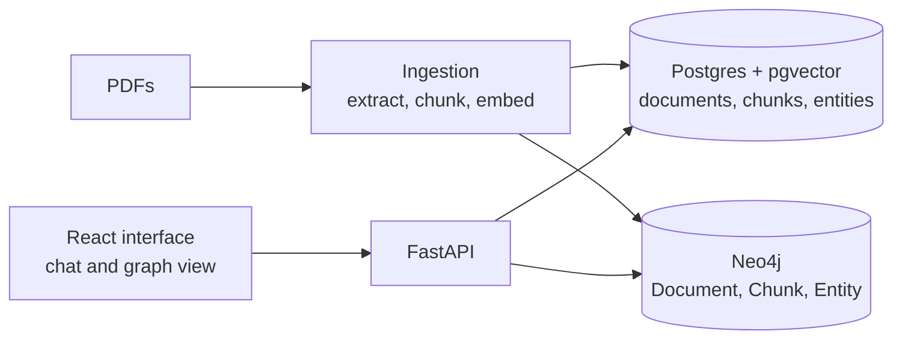

# Atlas

Semantic search over a corpus of research papers, with an entity graph and a
chat-style interface for exploring the results.

Atlas ingests PDFs, splits them into overlapping chunks, embeds each chunk,
and stores the vectors in Postgres with pgvector. A query is embedded the same
way, the closest chunks are retrieved, and documents are ranked by their best
chunks. For papers added through the upload endpoint, named entities are
extracted and stored in Neo4j, and the interface draws the documents, chunks
and entities behind each result as a graph.

## Corpus

| | |
|---|---|
| Documents | 5,238 research papers |
| Chunks | 180,834 (300 words each, 50-word overlap) |
| Embeddings | `sentence-transformers/all-MiniLM-L6-v2`, 384 dimensions |
| Database size | 971 MB in Postgres 15 with pgvector |
| Subject areas | AI/ML, finance, blockchain, transportation, healthcare, sports |

The papers themselves are not in this repository.

## What works today

- **Ingestion.** Text extraction with PyMuPDF, fixed-size chunking, and
  embedding. Bulk loads go through a Parquet file generated on a GPU; single
  PDFs go through the upload endpoint.
- **Dense retrieval.** Nearest-neighbour search over chunk embeddings with an
  IVFFlat index.
- **Document ranking.** A pool of the closest chunks is grouped by document,
  and each document is scored by the average distance of its best chunks.
- **Entity graph for uploaded PDFs.** spaCy named-entity recognition on each
  chunk, written to Postgres and to Neo4j as `Document`, `Chunk` and `Entity`
  nodes.
- **Interface.** A React chat view with saved history and a Cytoscape.js graph
  of the documents, chunks and entities behind the current results.

## Not built yet

These are in progress. Until an item is checked, the system does not do it.

- [ ] Lexical retrieval (BM25) fused with the dense results. A standalone
      prototype is in `backend/search/`; the API does not call it.
- [ ] ColBERT reranking. An indexing script exists; nothing uses the index at
      query time.
- [ ] Entity graph for the whole corpus. Entities currently cover only PDFs
      added through the upload endpoint (3,181 entities).
- [ ] Graph-aware retrieval. The graph is displayed but does not change which
      results are returned.
- [ ] Generated answers with citations.
- [ ] A labeled query set and retrieval metrics.
- [ ] API tests and continuous integration.

## How it fits together



## API

| Endpoint | What it does |
|---|---|
| `POST /ingest` | Uploads one PDF: chunks it, embeds it, extracts entities, writes to Postgres and Neo4j |
| `GET /search` | Returns the closest chunks to a query |
| `GET /search_with_entities` | The closest chunks, each with its entities from Neo4j |
| `GET /search_docs` | Documents ranked by their best chunks, with entities |
| `GET /search_rag` | The same ranking with document metadata and entities from Postgres |
| `POST /search_rag_plus_graph` | What the interface calls: ranked passages plus the graph behind them |

Interactive documentation is served at `http://localhost:8000/docs`.

## Screenshots


## Running it locally

You need Python 3.11 or newer, Docker, and Node.js 18 or newer with Yarn.

```bash
git clone https://github.com/RRB230899/atlas-ai-kg.git
cd atlas-ai-kg

cp .env.example .env            # then set the two passwords
docker compose up -d            # Postgres 15 with pgvector, Neo4j 5 Community

python -m venv .venv && source .venv/bin/activate
pip install -r requirements.txt

python docs/init_db.py          # creates the tables and indexes
uvicorn backend.fastapi.main:app --reload
```

In a second terminal:

```bash
cd frontend
yarn install
yarn dev                        # http://localhost:5173
```

### Loading data

Upload single PDFs through `POST /ingest`, either from the API documentation
page or with curl:

```bash
curl -F "file=@paper.pdf" http://localhost:8000/ingest
```

For a large corpus, generate the embeddings on a GPU with
`backend/ingestion/colab_bulk_ingestion.py`, which writes one Parquet file
with a row per chunk, and then load that file:

```bash
python -m backend.ingestion.bulk_insert_parquet path/to/atlas_embeddings.parquet
```

### Tests

```bash
python -m pytest tests
```

## Repository layout

```
backend/
  db.py                 Postgres connection shared by the API and the scripts
  fastapi/
    main.py             API endpoints
    utils.py            embedding model, document ranking, graph assembly
  ingestion/
    ingest.py                    one PDF: extract, chunk, embed, store
    ingest_with_graph.py         one PDF, plus entities into Postgres and Neo4j
    colab_bulk_ingestion.py      bulk embedding on a GPU, written to Parquet
    bulk_insert_parquet.py       loads the Parquet file into Postgres
    ingest_parquet_with_graph.py loads documents and chunks into Neo4j
  search/               BM25 and ColBERT prototypes, not used by the API yet
docs/
  init_db.py            creates the schema and indexes
  screenshots/
frontend/               React, Vite, Tailwind and Cytoscape.js interface
tests/
docker-compose.yml      Postgres and Neo4j for local development
```

## License

MIT. See [LICENSE](LICENSE).
